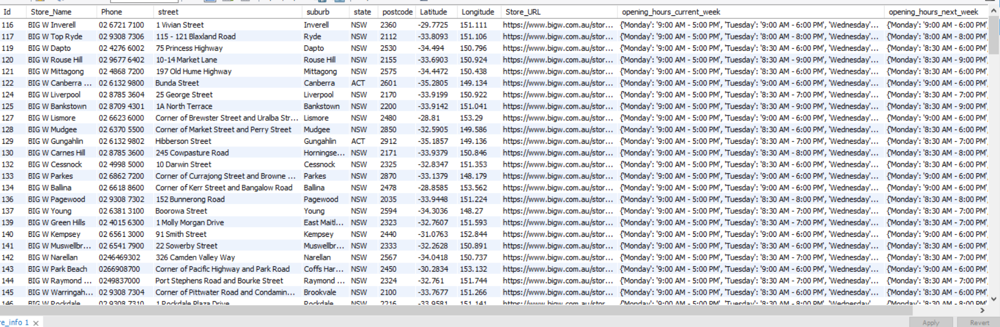

# SQL with python

Task - Fetch data from the API [https://api.bigw.com.au/api/stores/v0/list] and store attributes like store details and opening times etc. in MySQl database.

## Start guide

To run the script locally on you computer you must connect to the script file to your local database.

Changes required in code are on line 5.

```python
    db = mysql.connector.connect(
        host='localhost',
        user="root",
        password="root",
        auth_plugin='mysql_native_password',
        database="store_database"
    )
```

Change user password and database name of the on your local system.

Finally, you run the script file in cmd by typing command

```
    python script.py
```

in the same directory in which the script file is present.

## Image of database after running script
## store_info table


